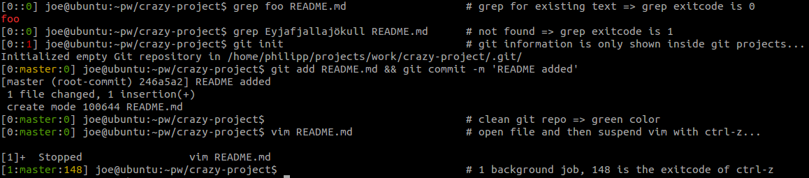

My custom PS1. It works well on Linux but has some minor display issues on OSX.


# Columns description:

````
[1:master:148] joe@ubuntu:~pw/crazy-project$
 ^    ^    ^    ^     ^    ^    ^
 |    |    |    |     |    |    |- Name of current directory
 |    |    |    |     |    |- First letters of parent directories (e.g. projects/work => pw)
 |    |    |    |     |- Hostname
 |    |    |    |- Username
 |    |    |- Exitcode of last bash command
 |    |- Current git branch/status
 |- Count of current background jobs
````

# Some examples:


